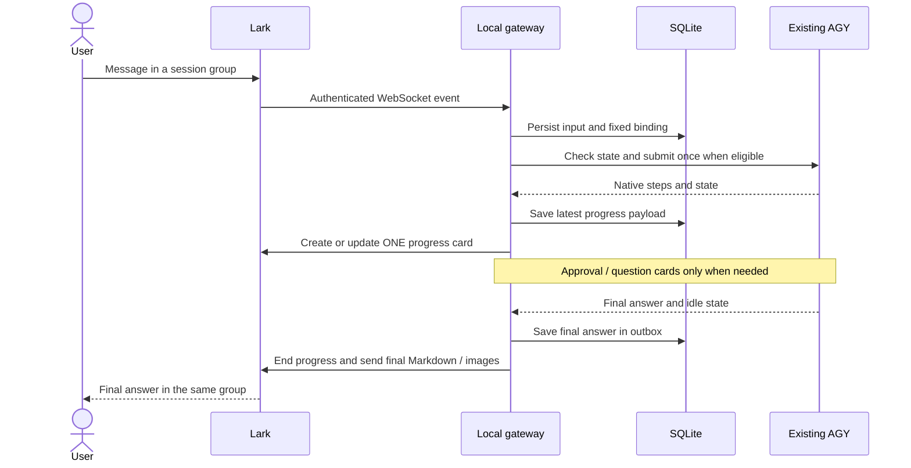

# Architecture

[简体中文](../zh-CN/architecture.md) · [Home](../../README.md) · [Development](development.md)

## Components and ownership

| Component | Responsibility | Owns |
|---|---|---|
| Lark bot and private groups | Messages, menus, interactive cards, images | Platform message IDs and group membership |
| Lark adapter | Authenticate envelopes, verify groups, normalize events, deliver/update cards | Transport state; no agent execution logic |
| Conversation Hub | Fixed routing, input queues, decisions, per-turn projection | Gateway operations and their target bindings |
| SQLite store | Durable inbox/outbox, queues, interactions, recovery | Owner, native bindings, message IDs, operation outcomes |
| AGY adapter | Discover one same-user instance; check bundle and capabilities; call native APIs | Access to the selected runtime, not a replacement history |
| AGY desktop | Agent execution, login/model, projects, native conversations | Native history and tool authorization |
| Rich-text renderer | Split Markdown, render Mermaid locally, upload images | Bounded in-memory render/upload cache |
| Lifecycle tools | Pair, diagnose, install, back up, upgrade, recover | Program/service ownership and migration decisions |

## End-to-end message flow

The bot private chat handles navigation and settings. Every registered session
group has a fixed binding; changing the private-chat selection does not reroute
its input. Group creation has a persisted identity and reconciliation marker.
An uncertain creation is looked up, not repeated blindly.

## Consistency and recovery

- A request ID correlates a local operation with a native input tag. A tag proves
  observation, not native idempotency; ambiguous submissions are not retried.
- The outbox persists each card's desired payload, revision, delivery result, and
  known platform message ID. A process restart can update the same message.
- Completed turns keep a stable identity. Old group history is excluded using a
  migration baseline; upgrades do not replay the entire conversation.
- Unknown writes pause submission until reconciliation or explicit local recovery.
  A snapshot can reveal gaps; it cannot prove that all events were replayed.
- The conservative scheduler submits at most one task at a time across active
  bound sessions. Desktop actions and unloaded native sessions cannot be globally locked.

## Trust boundaries

Lark events must match the configured app, tenant, and locally confirmed owner.
Group input/output additionally requires expected private membership. Interaction
tokens bind decisions to the owner, message, native request fingerprint, and expiry.

The AGY transport only discovers same-user matching processes and IPv4 loopback
listeners. It uses AGY's local self-signed HTTPS service, keeps its CSRF value in
memory, and disables environment proxies. Do not expose this native endpoint publicly.
The verified adapter uses a private AGY protocol, so a changed bundle disables writes.

Credentials and the database are local private files. Public assistant text and
selected command fields are projected after redaction; model thinking/signatures
are not sent. Mermaid rendering blocks remote requests and configuration overrides.
Selecting a project directory does not enforce a filesystem sandbox.

See [security history](../security.md), [compatibility](../compatibility.md), and
[test evidence](../E2E-COVERAGE.md) for observed limits. The historical PRD references
in early implementation notes refer to the original private planning document;
this page documents the current repository architecture.
