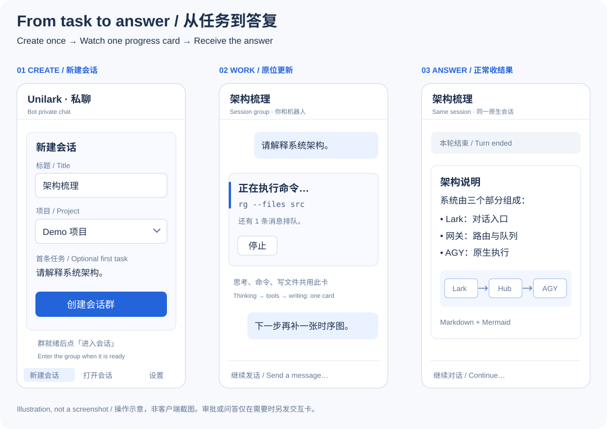

# User guide

[简体中文](../zh-CN/user-guide.md) · [Home](../../README.md) · [Installation](installation.md)

For **0.0.7**. First install and pair using the installation guide. The bot UI is
currently primarily Chinese; this guide includes the labels you will see.

Each native session has one private Lark group. The bot's private chat is your
control area for creating/opening sessions and settings. In a session group,
ordinary text goes to that group's fixed native conversation.



*Workflow illustration, not a client screenshot.*

## First conversation

<a id="u01"></a>
### U01 · Quick start

Open the bot's private chat and tap **新建会话 / New session**. Alternatively send
`/new-form`, or `/new My first task` for quick creation. When the group is ready,
tap **进入会话 / Enter session** and send:

```text
Do not use tools. Reply exactly: Connected.
```

A compact waiting/thinking card appears, followed by the final answer as a new
message at the bottom. Thinking, command previews, file work, and queue counts
update the original progress card. Empty intermediate replies and per-tool
receipts are not posted. Long final answers may use multiple messages.

Continue talking in that group; you do not need to @mention the bot. If it does
not answer, send `/status` there or follow U15/U20.

## Sessions and tasks

<a id="u02"></a>
### U02 · Create a session

The **新建会话** form accepts a title (1–80 characters), a known project, and an
optional first task (up to 2,000 characters). Submit with **创建会话群 / Create session group**.
The first task starts only after the private group is created and verified;
do not submit it again. Duplicate form submission does not create a second session.

Use `/cwd /absolute/project/path` first to select another existing directory for
future sessions. `/new Title` also works from an existing session group; it returns
an entrance to the new group and leaves the original group bound to its original session.

<a id="u03"></a>
### U03 · Connect an existing AGY conversation

```text
/attach NATIVE_UUID
```

Obtain the actual native UUID from the verified AGY instance or its operator.
Unilark cannot list all unbound desktop sessions or resolve one by title. The
session must belong to the configured instance and have readable history.
Empty history cannot establish a valid attachment.

The native conversation is reused, not cloned. Existing sessions can get a group
entrance through **建立群入口 / Create group entrance** in the list. Provisioning
waits for idle; old history is not copied into the new group. Resume archived
bindings using U13 rather than repeatedly attaching them.

<a id="u04"></a>
### U04 · Open and switch sessions

Use Lark's chat list, group-name search, and pins. To see all sessions, tap
**打开会话 / Open sessions**, or send `/list`, `/sessions`, or `/switch` without an ID.
The list shows five sessions per page with title, project, state, and queue size.
Use active/attention/archived filters and **查看任务 / View tasks** for details.

`/status` in a group describes that group's session. `/tasks` opens the overall
task view in private chat. `/switch BINDING_ID` remains a shortcut to details;
it does not change which session a group targets. Opening another group neither
moves an accepted task nor stops ongoing work.

<a id="u05"></a>
### U05 · Reply to an older message

Replying to a bot card inside the same group continues that group's session.
Cross-group card references or buttons cannot retarget work and are rejected.
Legacy private-chat reply cards retain their original binding; unquoted ordinary
text in private chat opens navigation instead of guessing a target.

Replying to **AGY 等待回答 / Waiting for an answer** answers that specific question
(U11). General navigation cards have no single session to quote as a task target.

<a id="u06"></a>
### U06 · Queues and input states

Ordinary text is the next task. When work is running, later messages queue locally;
the live card summarizes the queue without a separate receipt for each message.
Use `/status` for the actual queued items and reason they are waiting.

You can manage multiple sessions, but **execution concurrency remains one**.
An idle group can be waiting for another bound session. Cross-device requests
are not guaranteed a single global send-time ordering.

| Detail state | Meaning |
|---|---|
| `QUEUED` | Saved locally; not yet submitted |
| `SUBMITTING` | Submission in progress; do not assume it did not execute |
| `ACCEPTED` | AGY accepted the input; not a completion result |
| `UNKNOWN` | Submission outcome uncertain; inspect it (U16) |
| `REJECTED` | Rejected, or canceled locally before submission; inspect the explanation |
| `DISMISSED` | An operator accepted uncertainty and stopped tracking; not proof of no execution |
| Queue `PAUSED` | Further submissions paused; explicit continue is needed |

<a id="u07"></a>
### U07 · Add instructions to the running task

```text
/steer Please write the final result in English and include the evidence.
```

`/steer` addresses the running work. Ordinary text queues as the next task. A steer
does not undo existing side effects or guarantee immediate interruption of a command.
Unsupported runtime capabilities are reported rather than simulated.

<a id="u08"></a>
### U08 · Cancel input that has not been submitted

Open `/status` or `/cancel` without an ID and tap **撤销这项输入 / Cancel this input**.
The explicit form is `/cancel REQUEST_ID`. Only still-queued work can be canceled;
accepted, executing, or uncertain work cannot be treated as unsubmitted. Use stop
for running work. Request IDs are not session IDs.

<a id="u09"></a>
### U09 · Stop and continue

Tap **停止 / Stop** on the live card, **停止并暂停队列 / Stop and pause queue** in
details, or send `/stop` in the target group. After native stop confirmation,
the progress card shows **本轮已停止 / This turn was stopped**. An uncertain stop
is not reported as success. Already completed file/command effects are not undone.

The queue stays paused. Tap **继续队列 / Continue queue** or send `/continue` when
ready. Continue does not rerun an interrupted task or ignore unresolved uncertainty.
Old stop buttons cannot control a later native turn.

## Decisions and settings

<a id="u10"></a>
### U10 · Tool approval

On **AGY 请求批准 / Approval requested**, inspect the operation and choose
**仅本次允许 / Allow once** or **拒绝 / Deny**. Approval is for this request only,
not a permanent grant or proof the command succeeds. The card updates; ordinary
group chat does not add a separate decision receipt.

Wrong-owner, wrong-message, changed-request, used, and expired buttons are rejected.
An unanswered request expires about five minutes after the gateway records it and
is submitted as a denial; connectivity loss can delay that submission. Long operation
text may be truncated, so inspect it on the desktop if needed. The verified remote
approval path covers `run_command`; other tools may require desktop interaction.

<a id="u11"></a>
### U11 · Answer an agent question

For a single-choice question, tap an option. For free text, multiple questions,
or more choices than fit on the card, reply to that exact question card: one answer
per line, in order; separate multiple selections with commas. For example:

```text
Blue
One, Two
Please include an example.
```

The reply answers the original question rather than starting a new task.
**取消问题 / Cancel question** cancels it. An unanswered question expires after
about five minutes and is canceled. Do not use a stale question card for a new task.

<a id="u12"></a>
### U12 · Default project and Settings

Tap **设置 / Settings** or send `/settings` to see the default project and usage
summary. To change the directory used for future sessions:

```text
/cwd /absolute/path/to/project
```

The directory must already exist. With no argument, `/cwd` shows the current
preference. A session's project is fixed when creation is accepted; changing this
preference does not move existing sessions. Directory selection is not a sandbox.

<a id="u13"></a>
### U13 · Archive and resume

Use **归档会话 / Archive session** in details or `/archive` in its group. Active,
queued, or uncertain work can block archival. Archiving preserves native history
and the group; it does not delete files. In the archived list, choose resume or
send `/resume BINDING_ID` for the same native session. Resume retains a paused
queue until explicit continue. An empty native history may fail verification.

<a id="u14"></a>
### U14 · Command reference

| Command | Purpose |
|---|---|
| `/new-form`, `/new TITLE` | New-session form or quick creation |
| `/list`, `/sessions`, `/switch` | Session navigation |
| `/switch BINDING_ID` | Open a particular session's details |
| `/status`, `/tasks` | Current group details / overall tasks |
| `/attach NATIVE_UUID` | Connect an existing native conversation |
| `/steer TEXT` | Add instructions to running work |
| `/cancel [REQUEST_ID]` | View queued inputs / cancel one |
| `/stop`, `/continue` | Stop and pause / explicitly continue queue |
| `/archive`, `/resume [BINDING_ID]` | Archive / resume or open archived list |
| `/settings`, `/cwd [PATH]` | Settings / future-session directory |
| `/help`, `/` | Command panel |
| `/whoami`, `/capabilities` | Paired identity / verified capabilities |

Sending `/` opens a panel; **native input autocomplete is not implemented**.
Uppercase IDs in this guide are placeholders. If Settings does nothing but
`/settings` works, verify its configured event ID is exactly `unilark.settings`.

## Recovery and administration

<a id="u15"></a>
### U15 · Connection loss or restart

Keep the host and AGY running. If the connection drops during a turn, the existing
progress card can show uncertainty. Saved output is retried after recovery, but
upstream delivery of messages sent while offline and complete event replay are
not guaranteed. Check `/status` and the native conversation before resending work.
Restarting only the gateway does not stop AGY or replace session bindings.

<a id="u16"></a>
### U16 · UNKNOWN and blocked delivery

`UNKNOWN` means a write may have happened without a conclusive receipt. Do not
delete state or repeatedly submit the same input. A local operator should inspect
`unilark recovery list`, native history, and any known Lark message, then follow
the [recovery instructions](installation.md#troubleshooting-and-acceptance-evidence).
A blocked update with a known message ID can be retried after its cause is fixed;
an uncertain new message is not blindly recreated.

<a id="u17"></a>
### U17 · Install and pair

Use the [installation guide](installation.md). Credentials are entered locally
through hidden prompts. Existing owners are preserved; no pairing is needed for
routine restarts or compatible upgrades.

<a id="u18"></a>
### U18 · Acceptance and background handoff

Complete a real round trip, desktop continuation, and controlled approval/stop,
then install the single background service. Setup readiness, current doctor health,
and real user acceptance are different checks. Rich-card API readback has limits;
see the installation guide before interpreting an acceptance failure.

<a id="u19"></a>
### U19 · Service commands

Local operators use `unilark service status`, `start`, `stop`, or `restart`.
Add `--system` only for a system-service installation. Stopping the gateway does
not stop native work; request task stop first if that is your intent.

<a id="u20"></a>
### U20 · Diagnostics and exports

Use `unilark --config /absolute/path/agy.toml doctor --check-api` locally. Exit 0
means currently healthy; 2 means attention is needed. `diagnostics` and `audit`
export private reports without bodies/secrets; `history NATIVE_UUID` explicitly
prints native content. Keep those files private and follow the installation guide.

<a id="u21"></a>
### U21 · Backup, upgrade, and rollback

See [maintenance](installation.md#maintenance). Upgrades wait for an idle safe point,
back up consistently, and migrate a copy before switching. Schema 3 cannot be
opened by 0.0.4 or earlier. Rollback changes a compatible program, not accepted data.

<a id="u22"></a>
### U22 · Uninstall

Uninstall removes the owned program/service while retaining state, credentials,
backups, AGY, login, and project files. It does not erase your work.

## Rich results and group boundaries

<a id="u23"></a>
### U23 · Supported scope

One paired owner, one configured AGY instance, registered owner-and-bot groups.
Other identities and unregistered groups cannot start tasks. Multi-user collaboration,
incoming files/images, other engines, and simultaneous native execution are outside
this release. Original model thinking/signatures are not exposed in Lark.

<a id="u24"></a>
### U24 · Markdown and architecture diagrams

Answers support headings, emphasis, lists, quotes, inline/fenced code, links, and
tables. Long answers split at content boundaries; continued code is fenced and
table headers repeat. Lark may paginate tables with more than five rows inside a
component. Particularly large single rows are retained as text.

Try:

```text
Explain how Lark, Unilark, and AGY interact. Use Markdown and a Mermaid flowchart TD.
```

Complete Mermaid blocks become locally rendered images; tap to enlarge. Final
group output waits until the answer ends instead of posting partial diagrams.
Invalid or oversized diagrams and upload failures retain source text. Ask the
agent to simplify or correct the diagram. Vertical `flowchart TD` often suits phones.

Markdown content is shown inline. **A local `.md` path is not automatically sent
as a downloadable attachment.** Automatic collection/upload of generated local
files is not implemented. Diagram uploads need the configured browser and image scope.

<a id="u25"></a>
### U25 · Private group verification

The bot owns the group; the paired owner is its sole human member. Invitations,
editing, and sharing are restricted. If membership or permissions change, the
gateway suspends input/output and alerts the control private chat. Restore the
expected configuration and use the relevant retry/entrance control.

Never keep retrying group creation when its result is uncertain. The gateway first
looks for the original unique marker to avoid duplicate groups. Archived groups
remain in Lark; group deletion is not part of this release.

For the exact automated and manual validation boundaries, see
[E2E coverage](../E2E-COVERAGE.md).
