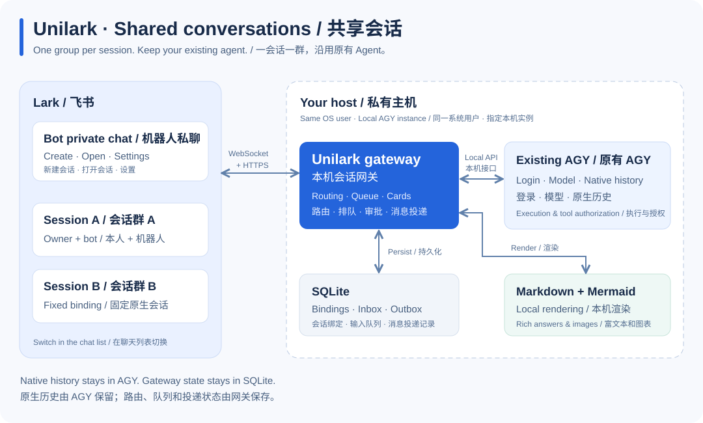
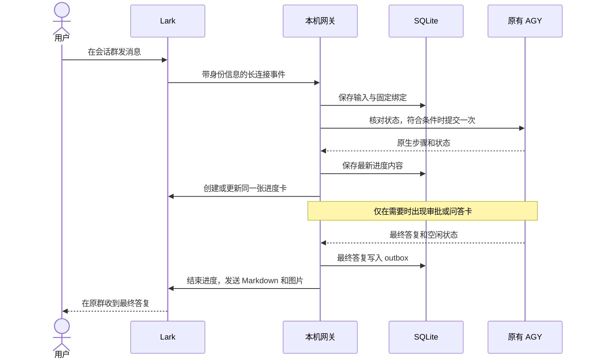

# 架构说明

[English](../en/architecture.md) · [首页](../../README.zh-CN.md) · [开发与验证](development.md)

## 组件与数据归属

| 组件 | 职责 | 持有的数据或权责 |
|---|---|---|
| Lark 机器人与私有群 | 消息、菜单、交互卡、图片 | 平台消息 ID、群成员关系 |
| Lark 适配器 | 验证事件身份、核验群、标准化事件、发送和更新卡片 | 传输状态，不负责 Agent 执行逻辑 |
| Conversation Hub | 固定路由、输入排队、决策、本轮消息投影 | 网关操作及其绑定目标 |
| SQLite 存储 | 持久化 inbox/outbox、队列、交互和恢复 | owner、原生绑定、消息 ID、操作结果 |
| AGY 适配器 | 找到同一用户的指定实例，核验 bundle/能力，调用原生接口 | 所选实例的访问，不另建一份会话历史 |
| AGY 桌面 | 执行 Agent、登录/模型、项目和原生会话 | 原生历史、工具授权 |
| 富文本渲染器 | 拆分 Markdown、本机渲染 Mermaid、上传图片 | 有界内存缓存 |
| 生命周期工具 | 配对、诊断、安装、备份、升级、恢复 | 程序/服务归属与迁移决策 |

## 消息流程

机器人私聊用于导航和设置，每个已登记会话群固定一个绑定；改变私聊中的选中项不会让群输入改投别处。
建群前持久化请求身份和唯一标记，结果不确定时先查找原群，不盲目重建。

## 一致性与恢复

- 请求 ID 把本地操作与原生输入 tag 对应起来。tag 证明已观测到输入，不证明原生幂等；未知提交不自动重发。
- outbox 保存卡片目标内容、版本、投递结果和已知平台消息 ID，进程重启后仍可更新原消息。
- 已完成轮次保留稳定身份；升级保存旧群历史基线，不重新发送全部历史。
- 未知写入暂停后续提交，等待核对或本机裁决。快照能发现缺口，但不能证明所有事件完整重放。
- 保守调度器在活动绑定会话间一次最多提交一个任务；无法全局锁住桌面操作或尚未加载的原生会话。

## 信任边界

Lark 事件必须匹配配置的应用、租户和本机确认的 owner；群输入输出另需核验预期的私有成员关系。
交互 token 绑定 owner、消息、原生请求指纹和有效期。

AGY 传输只发现同一用户下匹配的进程及 IPv4 回环监听，使用 AGY 本机自签名 HTTPS 服务，
CSRF 值仅存于内存且不使用环境代理。不要将原生端点暴露到公网。
当前适配器依赖已验证的私有协议，bundle 改变会禁用写入。

凭据和数据库为本机私有文件。公开答复和选择过的命令字段先脱敏再投影，不发送 thinking 或签名。
Mermaid 禁止远程网络请求及配置覆盖。选择项目目录不提供文件系统隔离。

实际边界见[安全记录](../security.md)、[兼容性](../compatibility.md)和 [E2E 对照](../E2E-COVERAGE.md)。
早期代码说明中的 PRD 编号来自原始私有规划文档；本页描述当前仓库架构。
